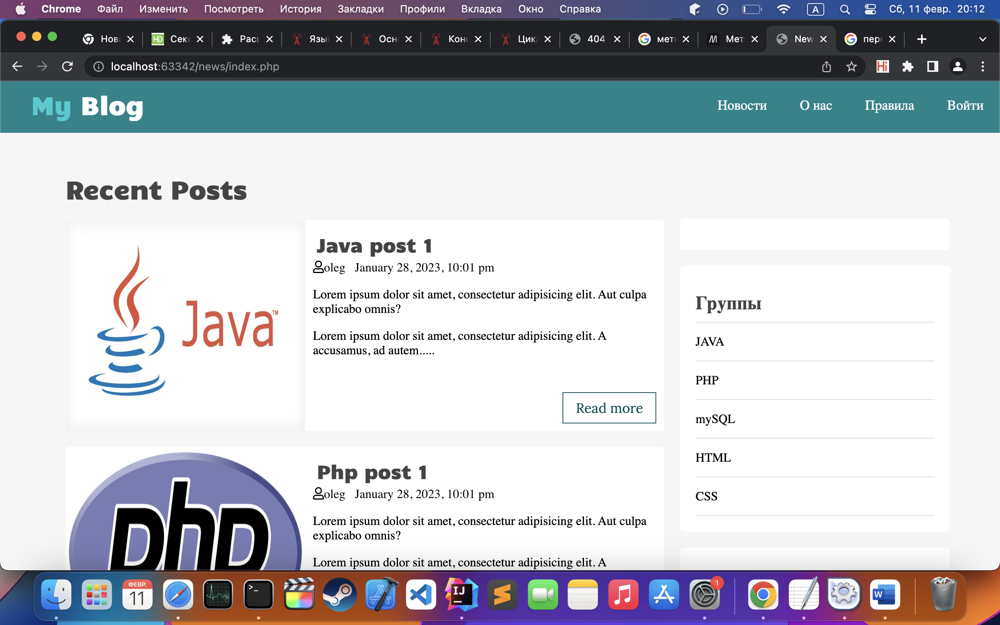

# NEWS BLOG

This is my news blog project on php,js,css and html for Progressive Media.

Menu
1) News (multilevel).
2) About us.
3) Rules (page with test text).

The News tab will have three levels:
1) The first level is the "News" page.
2) Second level - Group
3) Third level - Category.

News

The News page has parameters (all required)
1) Text.
2) Date.
3) Group.
4) Category.

   For example, news
   Title: "PHP 8. What's New?"
   Text: any can be copied from here https://ru.lipsum.com/
   
Group: php
   
Categories: For beginners, New
   
A news item can have only one group and several categories.

About Us

The "About us" page contains brief information about groups and categories. Next to the name of the group/category in parentheses contains the number of news with this group/category. Clicking on a title will take you to the corresponding page.
Implementation

Necessary
1) Design a database.
2) Install a local server (preferably openserver) and transfer the database.
3) Fill the database with test data (news text, at least 3 groups and 5 categories, at least 20 news).
4) Find a ready-made news site layout on the Internet.
5) The News page leads to the /news/ section.
6) The Group page leads to the page /news/group-[group name]/ (For example, /news/group-php/).
7) The Category page leads to /news/group-[group name]/[category name]/.
8) The php functionality is implemented through classes and calls to them (each function should be with a comment containing a brief essence).
9) Connecting to the database and getting data from the database is done using pdo tools only.
10) On the News page, if the user is not authorized, there is an authorization form. (you can create only 1 user and everything is right in the database)
11) It is necessary to remember the user when entering the site.
12) The menu should display only those groups and categories that have news.
13) It is necessary to implement page navigation webnews/?page=[page number], you can display 5 news per page.